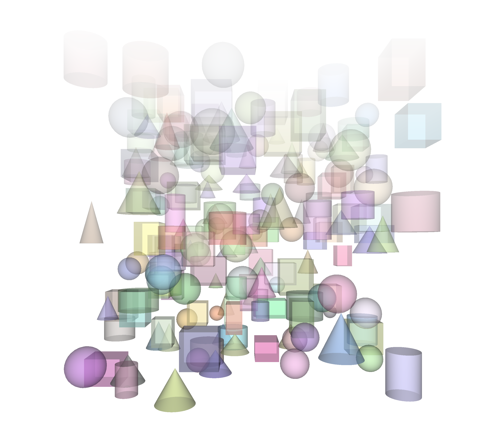
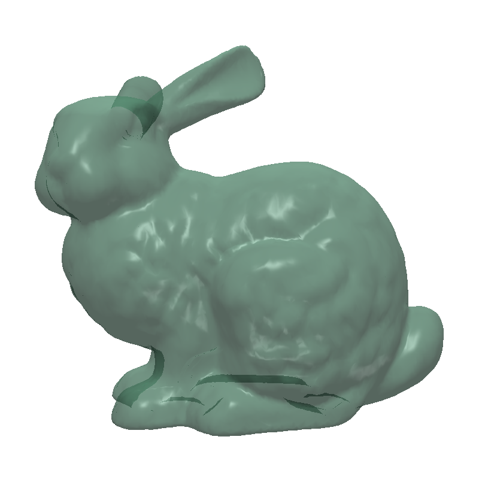
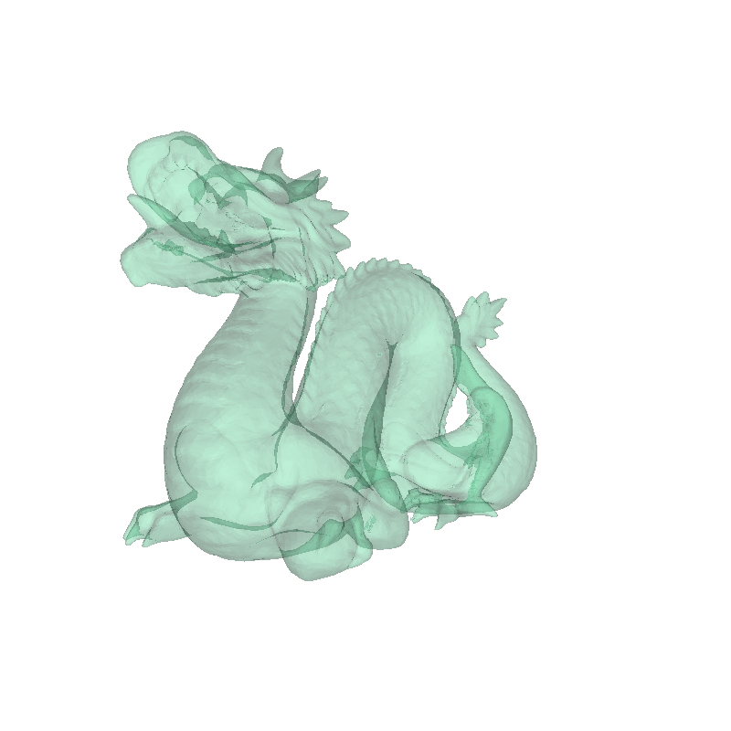
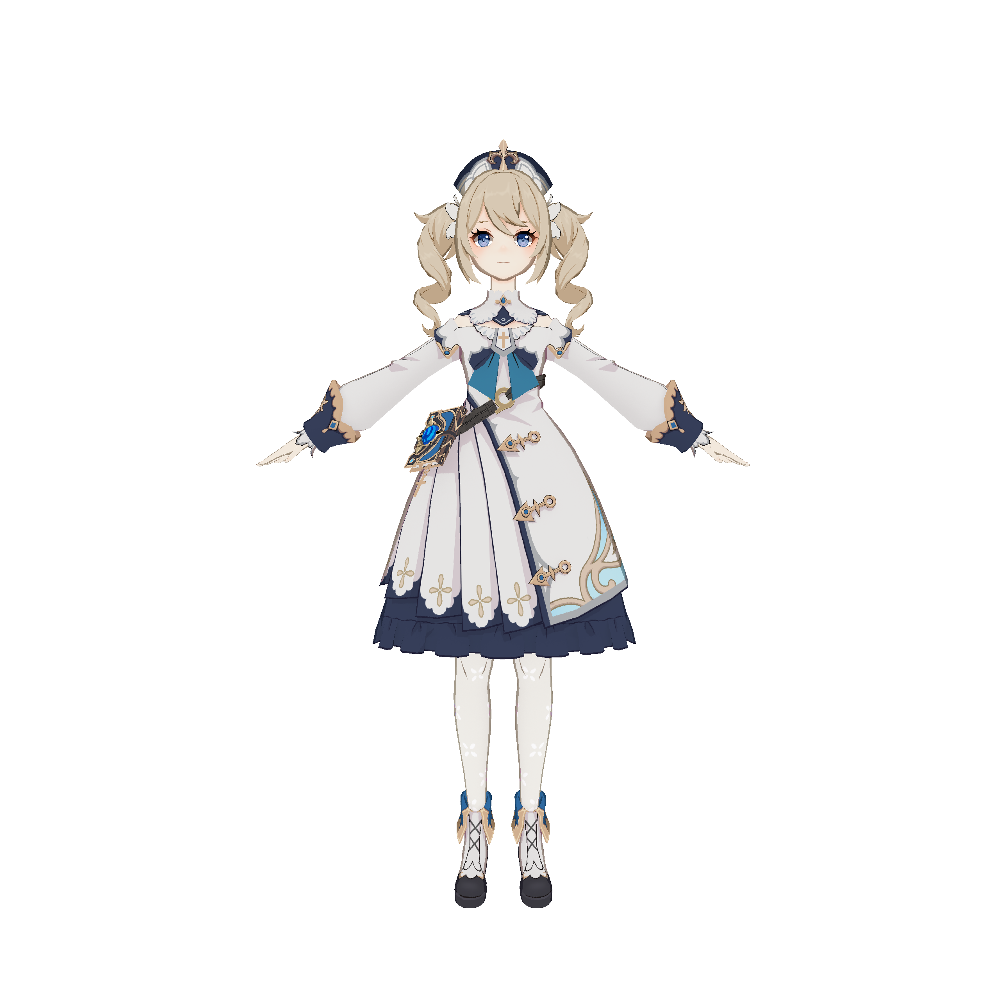
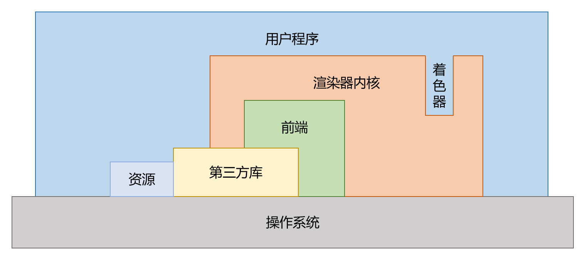
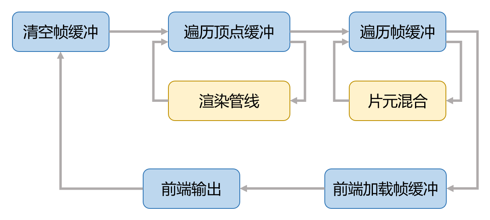

# SimpleCPURender


《基于软渲染的顺序无关透明混合算法实现》项目代码仓库。（simple 其实不 simple...）

项目代码在 `SimpleCPURender` 目录中。本项目实现了一个运行在 **CPU** 上的软渲染器内核，并提供多个可直接运行的用例（场景/风格/压力测试等）。你可以把它当作一个“可扩展的 C++ 渲染实验平台”：通过替换/编写着色器、加载模型与纹理、切换渲染用例，在不依赖 GPU 渲染管线的前提下完成实时/交互式的渲染展示。

---

## 效果预览

部分用例渲染效果示例：

| 场景 | 预览 |
| --- | --- |
| Cornell Box / 形体组合 |  |
| 模型渲染（示例：bunny） |  |
| 模型渲染（示例：dragon） |  |
| 模型渲染（示例：character） |  |

项目整体架构与渲染循环示意：




---

## 你能用它做什么

- 运行一个完整的 CPU 软渲染流程：从顶点处理到片元着色，再到最终输出。
- 渲染不透明与半透明物体，并支持顺序无关透明混合（OIT）相关流程开关（由用例参数控制）。
- 多线程渲染/混合（用例可配置线程数量），用于性能对比与压力测试。
- 加载 OBJ 模型与纹理资源，快速搭建场景进行展示。
- 编写你自己的 C++ 顶点/片元着色器，实现不同渲染风格。

---

## 快速开始（Windows + Visual Studio）

### 1) 环境要求

- Windows 10/11
- Visual Studio 2022（MSVC v143）
- C++17

第三方库：本仓库已包含常用依赖（例如 GLM、stb、tinyobjloader、OpenCV headers + libs）。工程已在 x64 配置下链接 `opencv_world4100(d).lib`，并在构建后自动将对应 DLL 拷贝到输出目录。

### 2) 编译

1. 用 Visual Studio 打开 `SimpleCPURender.sln`
2. 选择配置：`x64` + `Debug`（或 `Release`）
3. 生成解决方案（Build Solution）

### 3) 运行

直接在 VS 中“本地 Windows 调试器”运行即可。

注意：程序运行时会通过相对路径读取 `asset/` 下的模型/纹理。如果你在 VS 中运行时出现“找不到资源文件”，请将调试工作目录设置为仓库根目录：

- 项目属性 → 调试 → **工作目录** 设置为 `$(ProjectDir)`

（或在仓库根目录下直接运行生成的 exe。）

### 4) 快速开始用户代码（完整）

下面给出一份**可直接复制**的最小用例代码（着色器 + 模型加载 + 引擎创建 + 渲染循环），用于快速验证项目的基本使用方式。

说明：

- 工程里已配置好 `src/`、`src/kernel/` 与 `external/` 的 include 路径，因此下面的 include 写法可直接使用。
- 代码使用 `asset/obj/bunny.obj` 作为示例模型，请确保运行时工作目录为仓库根目录（见上面的“运行”小节）。

```cpp
// QuickStart example: Phong shading + alpha + OBJ loading + engine pipeline

#include <iostream>
#include <string>
#include <vector>
#include <stdexcept>
#include <ctime>
#include <cmath>

#include <glm/glm.hpp>
#include <glm/ext.hpp>
#include <tiny_obj_loader.h>

#include "Shader.h"
#include "TriangleTraversal.h"
#include "Engine.h"

using namespace oit;


// ------------------------------------------------------------
// 1) Shaders
// ------------------------------------------------------------
class PhongVertexShader : public VertexShader {
public:
	struct Input : public VertexShaderInput {
		Input() {}
		Input(const glm::vec3& model_pos, const glm::vec3& model_normal):
			model_pos(model_pos), model_normal(model_normal) {}
		glm::vec3 model_pos;    // vertex position in model space
		glm::vec3 model_normal; // vertex normal in model space
	};

	struct Output : public VertexShaderOutput {
		glm::vec3 world_pos;    // vertex position in world space
		glm::vec3 world_normal; // vertex normal in world space
		glm::vec3 view_pos;     // vertex position in view space
	};

public:
	PhongVertexShader() {}
	~PhongVertexShader() {}

	virtual VertexShaderInput* MakeInput() const override { return new Input; }
	virtual VertexShaderOutput* MakeOutput() const override { return new Output; }
	virtual void DestroyInput(VertexShaderInput* input) const override {
		delete reinterpret_cast<Input*>(input);
	}
	virtual void DestroyOutput(VertexShaderOutput* output) const override {
		delete reinterpret_cast<Output*>(output);
	}

	virtual void Call(const VertexShaderInput& input, VertexShaderOutput& output) override {
		const Input& rinput = reinterpret_cast<const Input&>(input);
		Output& routput = reinterpret_cast<Output&>(output);

		// Transform vertex to world space
		routput.world_pos = glm::vec3(model * glm::vec4(rinput.model_pos, 1.0f));
		// Transform normal to world space
		routput.world_normal = glm::normalize(
			glm::mat3(glm::transpose(glm::inverse(model))) * rinput.model_normal);
		// Transform vertex to view space
		routput.view_pos = glm::vec3(view * glm::vec4(routput.world_pos, 1.0f));
		// Transform vertex to clip space
		routput.__position__ = projection * view * model * glm::vec4(rinput.model_pos, 1.0f);
	}

public:
	glm::mat4 model;      // model transformation matrix
	glm::mat4 view;       // view transformation matrix
	glm::mat4 projection; // projection transformation matrix
};


class PhongFragmentShader : public FragmentShader {
public:
	struct Input : public FragmentShaderInput {
		glm::vec3 world_pos;    // position in world space
		glm::vec3 world_normal; // normal in world space
		glm::vec3 view_pos;     // position in view space
	};

	struct Output : public FragmentShaderOutput {};

public:
	PhongFragmentShader() {}
	~PhongFragmentShader() {}

	virtual FragmentShaderInput* MakeInput() const override { return new Input; }
	virtual FragmentShaderOutput* MakeOutput() const override { return new Output; }
	virtual void DestroyInput(FragmentShaderInput* input) const override {
		delete reinterpret_cast<Input*>(input);
	}
	virtual void DestroyOutput(FragmentShaderOutput* output) const override {
		delete reinterpret_cast<Output*>(output);
	}

	// Interpolate vertex attributes
	virtual void Interpolate(
		const VertexShaderOutput& v0,
		const VertexShaderOutput& v1,
		const VertexShaderOutput& v2,
		const glm::vec3& barycentric,
		FragmentShaderInput& fs_input
	) override {
		const auto& rv0 = reinterpret_cast<const PhongVertexShader::Output&>(v0);
		const auto& rv1 = reinterpret_cast<const PhongVertexShader::Output&>(v1);
		const auto& rv2 = reinterpret_cast<const PhongVertexShader::Output&>(v2);
		Input& rfs_input = reinterpret_cast<Input&>(fs_input);

		rfs_input.world_pos = InterpolateAttr(rv0.world_pos, rv1.world_pos, rv2.world_pos, barycentric);
		rfs_input.world_normal = glm::normalize(
			InterpolateAttr(rv0.world_normal, rv1.world_normal, rv2.world_normal, barycentric));
		rfs_input.view_pos = InterpolateAttr(rv0.view_pos, rv1.view_pos, rv2.view_pos, barycentric);
	}

	virtual void Call(const FragmentShaderInput& input, FragmentShaderOutput& output) override {
		const Input& rinput = reinterpret_cast<const Input&>(input);

		// Use uniform color
		glm::vec3 frag_color = obj_color;
		// Calculate normal and light direction (normalized)
		glm::vec3 normal = glm::normalize(rinput.world_normal);
		glm::vec3 light_dir = glm::normalize(light_pos - rinput.world_pos);
		// Calculate view direction
		glm::vec3 view_dir = glm::normalize(view_pos - rinput.world_pos);
		// Calculate reflection direction
		glm::vec3 reflect_dir = glm::reflect(-light_dir, normal);

		// 1. Ambient light
		glm::vec3 ambient = ka * frag_color;
		// 2. Diffuse light
		float diff = glm::max(glm::dot(normal, light_dir), 0.0f);
		glm::vec3 diffuse = kd * diff * frag_color * light_color;
		// 3. Specular light
		float spec = glm::pow(glm::max(glm::dot(view_dir, reflect_dir), 0.0f), shininess);
		glm::vec3 specular = ks * spec * light_color;

		// Combine all lighting components
		glm::vec3 color = ambient + diffuse + specular;
		// Set final color and alpha
		output.__color__ = glm::vec4(color, alpha);
	}

public:
	glm::vec3 light_pos;                     // light position
	glm::vec3 view_pos;                      // camera position
	glm::vec3 light_color = glm::vec3(1.0f); // light color
	glm::vec3 obj_color = glm::vec3(1.0f);   // object color
	float ka = 0.2f;                         // ambient coefficient
	float kd = 0.4f;                         // diffuse coefficient
	float ks = 0.4f;                         // specular coefficient
	float shininess = 32.0f;                 // specular exponent
	float alpha = 1.0f;                      // transparency
};


// ------------------------------------------------------------
// 2) Helpers: model loading + transform
// ------------------------------------------------------------
void LoadModel(const std::string& obj_path, VertexBuffer& vertex_buffer) {
	// use tiny_obj_loader to load mesh data
	tinyobj::attrib_t attrib;
	std::vector<tinyobj::shape_t> shapes;
	std::vector<tinyobj::material_t> materials;

	std::string err;
	std::string::size_type index = obj_path.find_last_of("/");
	std::string mtl_base_dir = obj_path.substr(0, index + 1);

	if (!tinyobj::LoadObj(&attrib, &shapes, &materials, &err, obj_path.c_str(), mtl_base_dir.c_str())) {
		throw std::runtime_error("load " + obj_path + " failure: " + err);
	}
	if (!err.empty()) {
		std::cerr << err << std::endl;
	}

	for (const auto& shape : shapes) {
		for (const auto& index : shape.mesh.indices) {
			glm::vec3 model_pos;
			model_pos.x = attrib.vertices[3 * index.vertex_index + 0];
			model_pos.y = attrib.vertices[3 * index.vertex_index + 1];
			model_pos.z = attrib.vertices[3 * index.vertex_index + 2];

			glm::vec3 model_normal;
			if (index.normal_index >= 0) {
				model_normal.x = attrib.normals[3 * index.normal_index + 0];
				model_normal.y = attrib.normals[3 * index.normal_index + 1];
				model_normal.z = attrib.normals[3 * index.normal_index + 2];
			}

			vertex_buffer.emplace_back(new PhongVertexShader::Input{model_pos, model_normal});
		}
	}

	printf("vertices:  %d\n", (int)vertex_buffer.size());
	printf("triangles: %d\n", (int)vertex_buffer.size() / 3);
}


glm::mat4 GetModelTransform(const glm::vec3& translation, float rotation, float scale) {
	// translation
	glm::mat4 translation_mat(
					1,             0,             0,          0,
					0,             1,             0,          0,
					0,             0,             1,          0,
		translation.x, translation.y, translation.z,          1
	);
	// rotation
	glm::mat4 rotation_mat(
		cos(rotation),     0, -sin(rotation),     0,
					0,     1,              0,     0,
		sin(rotation),     0,  cos(rotation),     0,
					0,     0,              0,     1
	);
	// scale
	glm::mat4 scale_mat(
		scale,     0,     0,    0,
			0, scale,     0,    0,
			0,     0, scale,    0,
			0,     0,     0,    1
	);
	return translation_mat * rotation_mat * scale_mat;
}


// ------------------------------------------------------------
// 3) Main
// ------------------------------------------------------------
int main() {
	// set up window size
	const int width = 800;
	const int height = 800;

	// new shaders
	auto* vshader = new PhongVertexShader;
	auto* fshader = new PhongFragmentShader;

	// initialize vertex shader
	const glm::vec3 translation(0.0f, 0.0f, 0.0f);
	const float rotation = glm::radians(0.0f);
	const float scale = 1.0f;
	vshader->model = GetModelTransform(translation, rotation, scale);

	const glm::vec3 eye(0.0f, 0.0f, 8.0f);
	const glm::vec3 target(0.0f, 0.0f, 0.0f);
	const glm::vec3 up(0.0f, 1.0f, 0.0f);
	vshader->view = glm::lookAt(eye, target, up);

	constexpr float fovy = glm::radians(60.0f);
	const float aspect = 1.0f * width / height;
	const float znear = 0.01f;
	const float zfar = 100.0f;
	vshader->projection = glm::perspective(fovy, aspect, znear, zfar);

	// initialize fragment shader
	fshader->light_pos = glm::vec3(0.0f, 10.0f, 10.0f);
	fshader->view_pos = eye;
	fshader->light_color = glm::vec3(1.0f);
	fshader->obj_color = glm::vec3(0.6f, 1.0f, 0.8f);
	fshader->shininess = 32.0f;
	fshader->alpha = 0.5f;

	// load a model to vertex buffer
	VertexBuffer vertex_buffer;
	LoadModel("asset/obj/bunny.obj", vertex_buffer);

	// create engine and create pipeline in it
	auto* engine = new Engine(width, height, 16, 16, glm::vec3(1.0f), INFINITY, 4, true);
	engine->CreatePipeline(vertex_buffer, vshader, fshader, ON_FACE, true);

	// render loop: rotate around Y-axis for 10 seconds
	float t0 = std::clock() / 1000.0f;
	while(true) {
		float t = std::clock() / 1000.0f - t0;
		vshader->model = GetModelTransform(translation, t, scale);
		engine->PipelinedRender(1, 1);
		if (t > 10.0f) break;
	}

	// cleanup (engine must be destroyed before shaders)
	delete engine;
	delete vshader;
	delete fshader;
	for(auto* input : vertex_buffer) delete input;

	return 0;
}
```

---

## 切换/运行用例

项目入口在 `src/main.cpp`。当前通过“创建不同用例对象并调用 `Run()`”来切换场景：

- `CornellBox`：形体随机生成/组合的 Cornell Box 类场景（适合做压力测试与效果对比）
- `Intensity`：加载模型并做强度/着色相关展示（示例中默认加载 `asset/obj/dragon.obj`）
- `Anime`：动画/交互式演示用例
- `QuickStart()`：一个从零搭建着色器、加载模型、创建引擎与管线的最小示例（位于 `src/usecase/Phong.cpp`）

建议做法：

1. 打开 `src/main.cpp`
2. 注释/取消注释你想运行的用例（仓库里已给出示例）
3. 重新编译运行

---

## 作为“库”使用（最小示例入口）

如果你希望从 API 使用角度快速上手，而不是直接跑现成用例：

- 参考 `src/usecase/Phong.cpp` 中的 `QuickStart()`

这个函数展示了典型使用流程：

1. 定义/创建顶点着色器与片元着色器
2. 加载 OBJ 模型到顶点缓冲
3. 创建引擎（Engine）并创建渲染管线（Pipeline）
4. 进入渲染循环并更新变换

---

## 资源与目录结构

常用目录：

- `src/`：项目源码
	- `src/kernel/`：渲染器内核（管线、帧缓冲、纹理/着色器接口等）
	- `src/usecase/`：用例（场景/风格/演示程序）
	- `src/test/`：一些基础组件的单元测试（可在 `main()` 中手动启用）
- `asset/`：模型、纹理等资源
	- `asset/obj/`：OBJ 模型
	- `asset/texture/`：纹理/HDR/skybox 等
- `external/`：第三方库（GLM、stb_image、tinyobjloader、OpenCV 等）
- `image/`：README 使用的配图与效果截图

---

## 常见问题

### 运行时找不到模型/纹理

原因通常是工作目录不在仓库根目录，导致相对路径（如 `asset/obj/dragon.obj`）解析失败。

处理方法：

- 在 VS 项目属性中将“工作目录”设为 `$(ProjectDir)`；或
- 在仓库根目录下运行输出的 exe。

### 启动时提示缺少 OpenCV DLL

工程对 x64 Debug/Release 都配置了构建后拷贝 DLL 的步骤；如果仍出现缺失：

- 检查输出目录（如 `x64/Debug/`）是否存在 `opencv_world4100d.dll`（Debug）或 `opencv_world4100.dll`（Release）
- 重新生成解决方案，确认 Post-Build Event 正常执行

---

## 致谢

本项目使用/集成了以下第三方库（见 `external/`）：GLM、stb_image、tinyobjloader、OpenCV。

